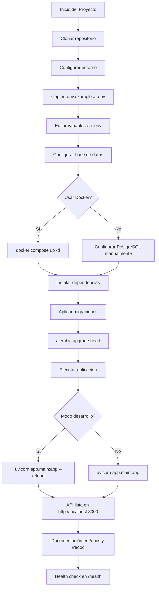
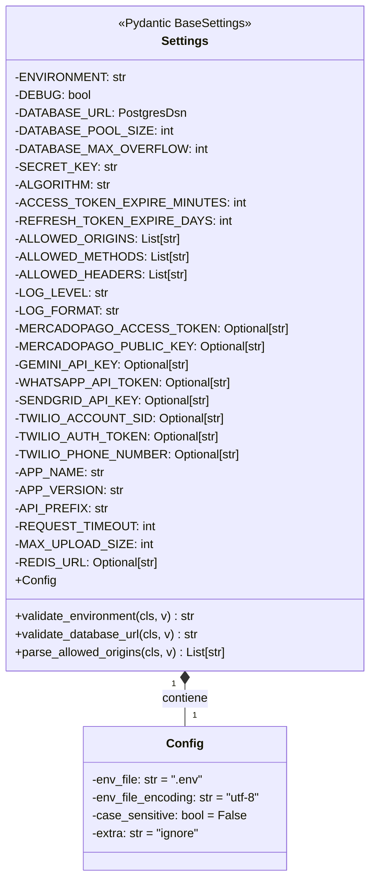
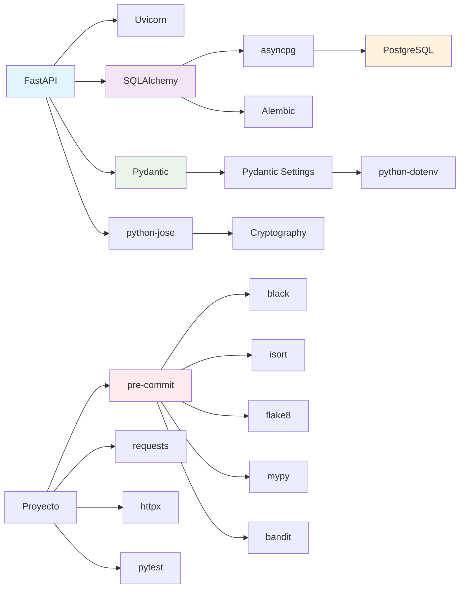

# 🏗️ Diagrama Visual de la Estructura

## 📊 Diagrama Mermaid de la Arquitectura

```mermaid
graph TB
    %% Estructura principal
    ROOT[comercializadora-v1.0.0/backend]
    
    %% Configuración y archivos raíz
    ROOT --> CONFIG[📄 Archivos de Configuración]
    CONFIG --> ENV[.env.example]
    CONFIG --> GITIGNORE[.gitignore]
    CONFIG --> EDITORCONFIG[.editorconfig]
    CONFIG --> PRECOMMIT[.pre-commit-config.yaml]
    CONFIG --> README[README.md]
    CONFIG --> ESTRUCTURA[ESTRUCTURA.md]
    CONFIG --> DIAGRAMA[DIAGRAMA.md]
    
    %% Infraestructura
    ROOT --> INFRA[🛠️ Infraestructura]
    INFRA --> DOCKERFILE[Dockerfile]
    INFRA --> DOCKERCOMPOSE[docker-compose.yml]
    INFRA --> REQUIREMENTS[requirements.txt]
    INFRA --> ALEMBICINI[alembic.ini]
    
    %% Aplicación FastAPI
    ROOT --> APP[📁 app/ - Aplicación FastAPI]
    APP --> MAIN[main.py]
    APP --> CONFIG_DIR[📁 config/]
    CONFIG_DIR --> SETTINGS[settings.py]
    
    %% Directorios vacíos para expansión futura
    APP --> API_DIR[📁 api/]
    API_DIR --> API_V1[📁 v1/]
    API_V1 --> ENDPOINTS[📁 endpoints/]
    
    APP --> CORE_DIR[📁 core/]
    APP --> MODELS_DIR[📁 models/]
    APP --> REPOSITORIES_DIR[📁 repositories/]
    APP --> SCHEMAS_DIR[📁 schemas/]
    APP --> SERVICES_DIR[📁 services/]
    APP --> UTILS_DIR[📁 utils/]
    
    %% Migraciones
    ROOT --> MIGRATIONS[📁 migrations/]
    MIGRATIONS --> ENV_PY[env.py]
    MIGRATIONS --> SCRIPT_MAKO[script.py.mako]
    MIGRATIONS --> VERSIONS[📁 versions/]
    VERSIONS --> INITIAL_MIGRATION[a6ba16149395_initial_migration.py]
    
    %% Otros directorios
    ROOT --> DOCS[📁 docs/]
    ROOT --> SCRIPTS[📁 scripts/]
    ROOT --> TESTS[📁 tests/]
```



## 🔄 Diagrama de Flujo de Configuración



## 🏗️ Diagrama de Clases (Settings)



## 🔗 Dependencias y Relaciones



## 📁 Estructura Jerárquica Detallada

```
comercializadora-v1.0.0/backend/
│
├── 📄 .editorconfig
├── 📄 .env.example
├── 📄 .gitignore
├── 📄 .pre-commit-config.yaml
├── 📄 Dockerfile
├── 📄 README.md
├── 📄 ESTRUCTURA.md
├── 📄 DIAGRAMA.md
├── 📄 alembic.ini
├── 📄 docker-compose.yml
├── 📄 requirements.txt
│
├── 📁 app/
│   ├── 📄 main.py
│   │
│   ├── 📁 api/
│   │   └── 📁 v1/
│   │       ├── 📁 endpoints/      # ← Futuros endpoints
│   │       │   ├── 📄 auth.py
│   │       │   ├── 📄 users.py
│   │       │   ├── 📄 products.py
│   │       │   └── 📄 orders.py
│   │       └── 📄 __init__.py
│   │
│   ├── 📁 config/
│   │   └── 📄 settings.py        # ⭐ Configuración principal
│   │
│   ├── 📁 core/                  # ← Futura lógica central
│   ├── 📁 models/                # ← Futuros modelos SQLAlchemy
│   ├── 📁 repositories/          # ← Futuro acceso a datos
│   ├── 📁 schemas/               # ← Futuros esquemas Pydantic
│   ├── 📁 services/              # ← Futura lógica de negocio
│   └── 📁 utils/                 # ← Futuras utilidades
│
├── 📁 docs/                      # ← Futura documentación
│
├── 📁 migrations/                # ✅ Migraciones configuradas
│   ├── 📄 env.py
│   ├── 📄 script.py.mako
│   ├── 📄 README
│   └── 📁 versions/
│       └── 📄 a6ba16149395_initial_migration.py
│
├── 📁 scripts/                   # ← Futuros scripts
│
└── 📁 tests/                     # ← Futuros tests
    ├── 📄 conftest.py
    ├── 📁 test_api/
    ├── 📁 test_models/
    └── 📁 test_services/
```

## 🎨 Leyenda de Símbolos

| Símbolo | Significado |
|---------|-------------|
| 📁 | Directorio |
| 📄 | Archivo |
| ⭐ | Archivo clave |
| ✅ | Configurado/completado |
| ← | Para desarrollo futuro |
| 🔄 | Flujo/proceso |
| 🏗️ | Estructura/arquitectura |
| 📊 | Diagrama/visualización |

## 📈 Evolución del Proyecto

```mermaid
timeline
    title Evolución del Backend
    section Fase 1: Configuración Inicial
        Enero 2026 : Setup inicial<br>FastAPI + PostgreSQL
        : Variables de entorno<br>y settings
        : Git configurado<br>con pre-commit hooks
    
    section Fase 2: Desarrollo Core
        Próximos pasos : Modelos de datos<br>y migraciones
        : Autenticación JWT<br>y seguridad
        : Endpoints CRUD<br>básicos
    
    section Fase 3: Integraciones
        Futuro : Integración con<br>MercadoPago
        : Integración con<br>WhatsApp API
        : Integración con<br>Google Gemini AI
    
    section Fase 4: Producción
        Despliegue : Docker optimizado<br>para producción
        : Monitoring<br>y logging
        : Escalabilidad<br>y performance
```

---

**Visualización creada**: Enero 2026  
**Herramientas**: Mermaid.js, Markdown  
**Propósito**: Documentación visual de la arquitectura  
**Estado**: Configuración inicial completada ✅

